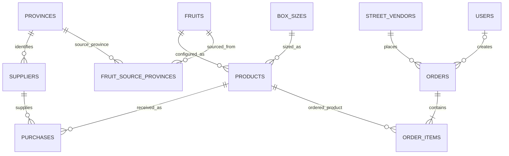

# Database ERD

```mermaid
erDiagram
    PROVINCES ||--o{ SUPPLIERS : identifies
    FRUITS ||--o{ PRODUCTS : configured_as
    BOX_SIZES ||--o{ PRODUCTS : sized_as
    FRUITS ||--o{ FRUIT_SOURCE_PROVINCES : sourced_from
    PROVINCES ||--o{ FRUIT_SOURCE_PROVINCES : source_province
    SUPPLIERS ||--o{ PURCHASES : supplies
    PRODUCTS ||--o{ PURCHASES : received_as
    STREET_VENDORS ||--o{ ORDERS : places
    ORDERS ||--|{ ORDER_ITEMS : contains
    PRODUCTS ||--o{ ORDER_ITEMS : ordered_product
    USERS o|--o{ ORDERS : creates
```

The database schema and foreign keys in `server/database.sql` are the source of truth for exact column definitions and constraints.
